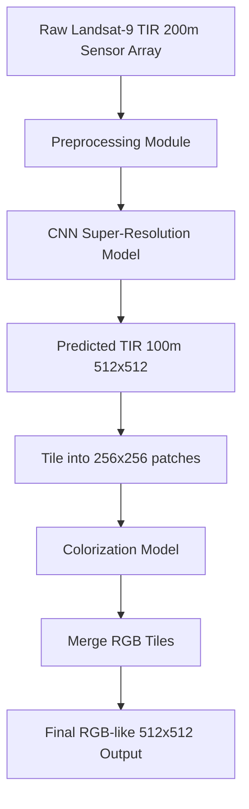
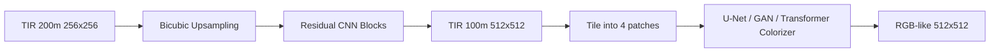
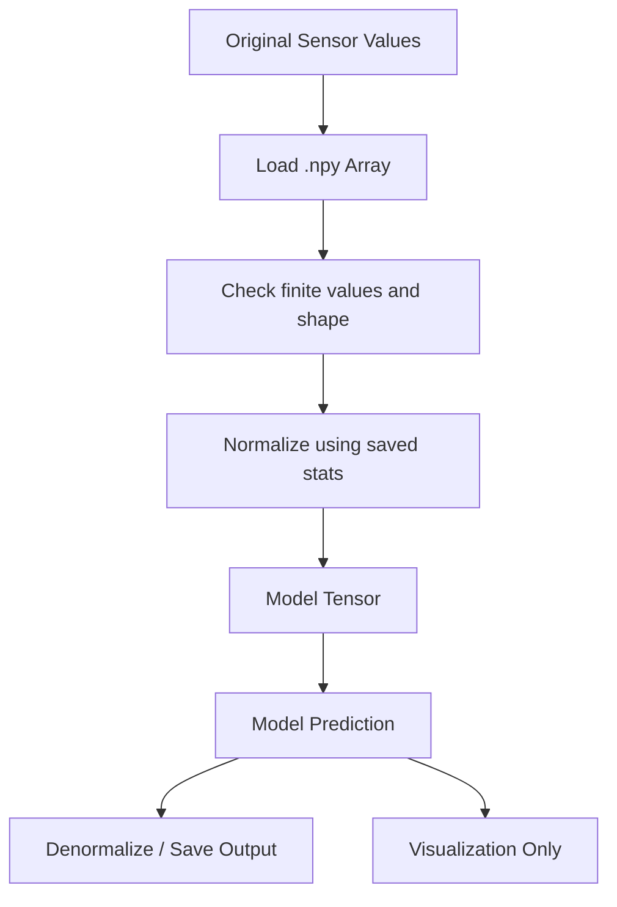

# ISRO Hackathon Project Documentation  
## Landsat-9 Thermal Infrared Super-Resolution and Colorization using Original Sensor Values

---

## 1. Project Title

**Infrared Image Super-Resolution and Colorization using Original Landsat-9 Sensor Values**

---

## 2. One-Line Summary

This project builds a two-stage deep learning pipeline that takes original Landsat-9 thermal infrared sensor values, enhances their spatial resolution, and generates interpretable RGB-like outputs while keeping visualization-based processing completely separate from model input.

---

## 3. Problem Statement

Infrared and thermal satellite images contain important temperature and surface-emission information, but they are often difficult for humans to interpret directly. Raw thermal imagery is usually single-channel, low-contrast, and less visually intuitive than RGB imagery.

The goal of this project is to:

1. Improve the spatial resolution of Landsat-9 thermal infrared data.
2. Convert enhanced thermal data into interpretable RGB-like outputs.
3. Preserve physical sensor meaning by using original sensor values, not visualization-processed images.
4. Build a modular pipeline that can run on a common evaluation dataset during the hackathon finale.

---

## 4. Challenge Alignment

This project aligns with the hackathon theme of:

**Infrared Image Colorization and Enhancement for Object Interpretation**

The key requirements of this challenge are:

- Enhance infrared imagery for better interpretation.
- Colorize thermal/infrared imagery in a meaningful way.
- Preserve important physical patterns in infrared data.
- Avoid unrealistic or hallucinated visual outputs.
- Use computer vision and deep learning models such as CNNs, GANs, and transformer-based models.

Our project specifically focuses on **Landsat-9 Thermal Infrared Sensor data** and builds the solution around original satellite sensor values.

---

## 5. Important Organizer Constraint

The organizer specifically mentioned:

> Use original sensor values and not values processed for visualization. If needed, build a preprocessing pipe that adapts Landsat data to the model's required format.

This is one of the most important parts of the solution.

### What this means

The model must not use:

- PNG screenshots
- Matplotlib-rendered images
- Color-mapped thermal images
- Percentile-stretched images
- Any image generated only for visualization

The model must use:

- Original `.npy` arrays
- Original thermal sensor values
- Original RGB/reference sensor arrays
- A saved preprocessing pipeline for normalization and scaling

### Our response to this constraint

The pipeline uses original `.npy` sensor arrays for training and inference.

Visualization functions such as:

```python
plt.imshow(...)
rgb_stretch(...)
percentile stretch
thermal colormaps
```

are used only for plots and human-readable figures. They are never used as model input.

---

## 6. Core Idea

The project is divided into two main tasks:

```text
Task 1: Thermal Super-Resolution

TIR 200m, 256 × 256
        ↓
Super-Resolution Model
        ↓
TIR 100m, 512 × 512
```

```text
Task 2: Thermal-to-RGB Colorization

TIR 100m, 256 × 256
        ↓
Colorization Model
        ↓
RGB 100m, 3 × 256 × 256
```

Final inference connects both tasks:

```text
Raw TIR 200m input
        ↓
Super-resolution model
        ↓
Predicted TIR 100m 512 × 512
        ↓
Split into four 256 × 256 tiles
        ↓
Colorization model
        ↓
Predicted RGB-like 512 × 512 output
```

---

## 7. Dataset

### Dataset Root

The confirmed dataset path in Google Drive is:

```python
DATASET_ROOT = "/content/drive/MyDrive/landsat_india_200/dataset_current_repo_format"
```

---

## 8. Verified Dataset Counts

Dataset sanity check confirmed the following file counts:

| Split | SR Input TIR 200m | SR Target TIR 100m | Color Input TIR 100m | Color Target RGB 100m |
|---|---:|---:|---:|---:|
| Train | 810 | 810 | 810 | 810 |
| Validation | 210 | 210 | 210 | 210 |
| Test | 240 | 240 | 240 | 240 |

All pairs matched correctly by filename. No missing input or target pairs were found.

---

## 9. Verified Data Shapes

### Super-Resolution Dataset

| Data | Shape | Meaning |
|---|---|---|
| Input | `(256, 256)` | TIR 200m thermal patch |
| Target | `(512, 512)` | TIR 100m higher-resolution thermal patch |

After loading into PyTorch:

```text
Input batch  = [B, 1, 256, 256]
Target batch = [B, 1, 512, 512]
```

### Colorization Dataset

| Data | Shape | Meaning |
|---|---|---|
| Input | `(256, 256)` | TIR 100m thermal patch |
| Target | `(3, 256, 256)` | RGB 100m reference patch |

After loading into PyTorch:

```text
Input batch  = [B, 1, 256, 256]
Target batch = [B, 3, 256, 256]
```

---

## 10. Sample Data Ranges Observed

During sanity checks, thermal values were approximately in the range:

```text
TIR values: around 290 K to 331 K
```

RGB target values were approximately in the range:

```text
RGB values: around 0.00 to 0.30
```

These values confirm that the `.npy` arrays are not simple 8-bit visualization images. They are original/scientific array values.

---

## 11. Folder Structure

Expected dataset structure:

```text
dataset_current_repo_format/
│
├── sr/
│   ├── train/
│   │   ├── tir_200m/
│   │   └── tir_100m/
│   ├── val/
│   │   ├── tir_200m/
│   │   └── tir_100m/
│   └── test/
│       ├── tir_200m/
│       └── tir_100m/
│
└── colorization/
    ├── train/
    │   ├── tir_100m/
    │   └── rgb_100m/
    ├── val/
    │   ├── tir_100m/
    │   └── rgb_100m/
    └── test/
        ├── tir_100m/
        └── rgb_100m/
```

---

## 12. Preprocessing Pipeline

### Why preprocessing is needed

Neural networks train better when input values are normalized. Thermal values are in Kelvin, usually around 290–331. Feeding these raw numbers directly into the model is possible, but normalization improves stability.

### Important clarification

Normalization is not visualization.

Normalization is a model preprocessing step:

```text
Original sensor value
        ↓
Numerical normalization
        ↓
Model tensor
```

Visualization is separate:

```text
Original/predicted array
        ↓
Stretching or colormap
        ↓
Human-readable plot only
```

---

## 13. Thermal Normalization

The basic normalization used:

```python
normalized_tir = (tir_value - TIR_MEAN) / TIR_STD
```

Initial simple values:

```python
TIR_MEAN = 300.0
TIR_STD = 20.0
```

Improved adaptive version:

```python
TIR_MEAN = train_set_mean
TIR_STD = train_set_std
```

The final version should save preprocessing statistics in:

```text
preprocess_stats.json
```

This ensures the same transformation is used during hackathon evaluation.

---

## 14. RGB Scaling

RGB/reference arrays are scaled for model output using train-set statistics:

```python
normalized_rgb = (rgb - rgb_min) / (rgb_max - rgb_min + 1e-8)
```

During final inference, predicted RGB is converted back:

```python
rgb_original_scale = normalized_rgb * (rgb_max - rgb_min) + rgb_min
```

This keeps model output compatible with original sensor/reference value ranges.

---

## 15. Why We Do Not Train on PNG Images

PNG images are usually:

- clipped
- stretched
- color-mapped
- converted to 8-bit
- processed for visual appearance

Using PNGs would destroy physical meaning.

For example:

```text
Original thermal value: 312.48 K
After visualization: RGB color such as [230, 90, 40]
```

The RGB color from a colormap is not the original thermal measurement.

Therefore, the model uses `.npy` arrays directly.

---

## 16. Model Overview

The project contains four major deep learning models:

1. CNN Super-Resolution model
2. CNN U-Net Colorization model
3. Pix2Pix GAN Colorization model
4. Tiny Transformer Colorization model

The CNN models are the safest and most important baseline. GAN and Transformer models are added for comparison and technical depth.

---

# PART A — Super-Resolution Model

---

## 17. Super-Resolution Objective

The SR model learns:

```text
Input:  TIR 200m  256 × 256
Output: TIR 100m  512 × 512
```

It improves thermal spatial resolution from lower-resolution TIR patches to higher-resolution TIR patches.

---

## 18. SR Model Type

The SR model is a:

```text
CNN-based residual super-resolution model
```

It is inspired by classical residual super-resolution pipelines.

---

## 19. SR Model Architecture

The model is called:

```python
SimpleSRNet
```

### Architecture flow

```text
Input TIR 200m
[Batch, 1, 256, 256]
        ↓
Bicubic upsampling
[Batch, 1, 512, 512]
        ↓
CNN feature extraction
        ↓
Residual CNN blocks
        ↓
Prediction of correction image
        ↓
Bicubic image + correction
        ↓
Predicted TIR 100m
[Batch, 1, 512, 512]
```

---

## 20. Why Bicubic Upsampling First?

The input and target have different spatial sizes:

```text
Input  = 256 × 256
Target = 512 × 512
```

So first, bicubic interpolation converts the input to the correct output size.

Then the CNN learns the residual correction:

```text
Final output = Bicubic upsampled image + CNN correction
```

This is easier than asking the CNN to generate the full high-resolution image from scratch.

---

## 21. SR Model Code Summary

```python
class SimpleSRNet(nn.Module):
    def forward(self, x):
        x_up = F.interpolate(
            x,
            scale_factor=2,
            mode="bicubic",
            align_corners=False
        )

        feat = F.relu(self.head(x_up))
        feat = self.body(feat)
        residual = self.tail(feat)

        return x_up + residual
```

---

## 22. SR Loss Function

The SR model uses:

```python
nn.L1Loss()
```

This measures the absolute difference between predicted and actual TIR values.

Because TIR values are normalized, the loss can be converted approximately back to Kelvin:

```text
Kelvin MAE ≈ normalized_L1_loss × TIR_STD
```

Example:

```text
Validation L1 = 0.03
TIR_STD = 20
Approx Kelvin MAE = 0.6 K
```

---

## 23. SR Evaluation Metrics

Recommended SR metrics:

| Metric | Meaning |
|---|---|
| L1 Loss | Average absolute error in normalized scale |
| MAE Kelvin | Average absolute temperature error |
| MSE | Mean squared error |
| PSNR | Image reconstruction quality |
| Visual Error Map | Spatial distribution of errors |

---

# PART B — CNN Colorization Model

---

## 24. Colorization Objective

The colorization model learns:

```text
Input:  TIR 100m  256 × 256
Output: RGB 100m  3 × 256 × 256
```

This converts thermal infrared information into an RGB-like representation that is easier for humans to interpret.

---

## 25. CNN Colorization Model Type

The baseline colorization model is:

```text
U-Net style convolutional neural network
```

Model name:

```python
ColorUNet
```

---

## 26. Why U-Net?

U-Net is suitable for image-to-image tasks because it has:

- encoder path to learn high-level features
- decoder path to reconstruct image output
- skip connections to preserve spatial details
- strong performance on small-to-medium datasets

---

## 27. Color U-Net Architecture

```text
Input TIR
[Batch, 1, 256, 256]
        ↓
Encoder Block 1
        ↓
Encoder Block 2
        ↓
Encoder Block 3
        ↓
Encoder Block 4
        ↓
Bottleneck
        ↓
Decoder Block 4 + skip connection
        ↓
Decoder Block 3 + skip connection
        ↓
Decoder Block 2 + skip connection
        ↓
Decoder Block 1 + skip connection
        ↓
Sigmoid output
[Batch, 3, 256, 256]
```

---

## 28. Colorization Loss

The CNN colorization model uses:

```python
nn.L1Loss()
```

This compares:

```text
Predicted RGB tensor
vs
Target RGB tensor
```

L1 is chosen because it is stable and less blurry than pure MSE in many image-to-image tasks.

---

## 29. Colorization Evaluation Metrics

Recommended colorization metrics:

| Metric | Meaning |
|---|---|
| L1 RGB | Average absolute RGB error |
| MSE RGB | Mean squared RGB error |
| PSNR RGB | Image reconstruction quality |
| Visual comparison | Input TIR vs target RGB vs predicted RGB |
| Error heatmap | Average RGB absolute error |

---

# PART C — Pix2Pix GAN Colorization

---

## 30. Why Add GAN?

CNN outputs may become smooth or slightly blurry. GANs can produce sharper and more visually realistic outputs.

The GAN is not the first model because GAN training is less stable. It is added after the CNN baseline.

---

## 31. GAN Type

The GAN used is:

```text
Pix2Pix-style conditional GAN
```

It contains:

1. Generator
2. Discriminator

---

## 32. Generator

The generator is the same U-Net architecture:

```text
Input TIR 100m
        ↓
U-Net Generator
        ↓
Predicted RGB
```

---

## 33. Discriminator

The discriminator is a PatchGAN-style discriminator.

It receives:

```text
TIR input + RGB image
```

It decides whether the RGB image is real or fake.

```text
Real pair:
TIR + actual RGB

Fake pair:
TIR + generated RGB
```

---

## 34. GAN Loss

Generator loss:

```text
Generator Loss = GAN Loss + λ × L1 Loss
```

Usually:

```python
lambda_l1 = 100
```

The L1 term keeps the generated image close to ground truth. The GAN term encourages sharper, more realistic textures.

---

## 35. Why Warm-Start GAN from CNN?

The GAN generator can be initialized from the trained CNN U-Net.

This helps because:

- generator already knows basic colorization
- GAN training becomes more stable
- fewer epochs are needed
- output is less random

---

# PART D — Tiny Transformer Colorization

---

## 36. Why Add Transformer?

CNNs are excellent at local spatial patterns. Transformers can learn broader context and long-range relationships.

For satellite imagery, this can help with:

- large terrain structures
- spatial consistency
- global context
- smooth transitions across regions

---

## 37. Transformer Model Type

The transformer model is:

```text
Tiny Vision Transformer style colorization model
```

Model name:

```python
TinyViTColorNet
```

---

## 38. Transformer Architecture

```text
Input TIR
[Batch, 1, 256, 256]
        ↓
Patch Embedding
        ↓
Transformer Encoder
        ↓
CNN Decoder
        ↓
RGB Output
[Batch, 3, 256, 256]
```

---

## 39. Why Tiny Transformer?

The dataset contains 810 training patches. A full large transformer may overfit or train slowly.

A tiny transformer is safer because it has:

- fewer parameters
- faster training
- lower overfitting risk
- enough capacity for comparison

---

# PART E — Final Combined Pipeline

---

## 40. Final Inference Pipeline

The final deployed pipeline is:

```text
Raw TIR 200m 256 × 256
        ↓
Preprocessing using saved TIR statistics
        ↓
CNN Super-Resolution Model
        ↓
Predicted TIR 100m 512 × 512
        ↓
Split into 4 tiles of 256 × 256
        ↓
Colorization Model
        ↓
Merge 4 RGB tiles
        ↓
Final RGB-like 512 × 512 output
```

---

## 41. Why Tiling Is Needed

The SR model outputs:

```text
512 × 512
```

The colorization model was trained on:

```text
256 × 256
```

So the 512 × 512 SR output is split into four tiles:

```text
Top-left      256 × 256
Top-right     256 × 256
Bottom-left   256 × 256
Bottom-right  256 × 256
```

Each tile is colorized separately and merged back.

---

## 42. Final Output Format

Final outputs saved by the notebook:

```text
pred_tir100m_512.npy
pred_rgb_chw.npy
pred_rgb_bgr.tif
```

Important:

```text
Training RGB format: RGB, channel-first, C × H × W
Saved TIFF format: BGR order if required
```

---

# PART F — Implementation Details

---

## 43. Main Notebook

Notebook file:

```text
landsat9_full_sr_colorization_models.ipynb
```

It contains:

1. Setup
2. Dataset sanity check
3. Dataset classes
4. Visualization helpers
5. CNN SR model
6. CNN Colorization model
7. Training utilities
8. SR training
9. SR visualization
10. CNN colorization training
11. CNN colorization visualization
12. Pix2Pix GAN model
13. Pix2Pix training
14. GAN visualization
15. Tiny Transformer model
16. Transformer training
17. Transformer visualization
18. Model comparison
19. Final two-stage inference

---

## 44. Recommended Fast Run Order

When time is limited, run this first:

```text
1. Setup
2. Dataset sanity check
3. Dataset classes and dataloaders
4. Visualization helpers
5. CNN SR model
6. CNN Colorization model
7. Shared training utilities
8. Train CNN SR model
9. Visualize SR prediction
10. Train CNN Colorization model
11. Visualize CNN colorization
19. Final two-stage inference
```

Only run GAN and Transformer after the CNN pipeline is working.

---

## 45. Recommended Epoch Settings

### Quick Debug Run

```python
SR_EPOCHS = 2
COLOR_CNN_EPOCHS = 2
GAN_EPOCHS = 1
VIT_EPOCHS = 1
```

### Fast Hackathon Run

```python
SR_EPOCHS = 5
COLOR_CNN_EPOCHS = 5
GAN_EPOCHS = 2
VIT_EPOCHS = 2
```

### Better Final Run

```python
SR_EPOCHS = 20
COLOR_CNN_EPOCHS = 25
GAN_EPOCHS = 10
VIT_EPOCHS = 15
```

---

## 46. Hardware Requirements

Recommended:

```text
GPU: Google Colab T4 / L4 / A100 or Kaggle GPU
RAM: 12 GB minimum
Disk: Enough space for checkpoints and outputs
Framework: PyTorch
```

---

## 47. Python Libraries Used

Core libraries:

```text
torch
torchvision
numpy
matplotlib
tqdm
glob
os
json
```

Optional output libraries:

```text
tifffile
rasterio
GDAL
```

For final geospatial support:

```text
rasterio
geopandas
folium
streamlit
```

---

# PART G — Training Strategy

---

## 48. Training Strategy

The training strategy is staged:

```text
Stage 1: Validate dataset and pair matching
Stage 2: Train simple CNN SR baseline
Stage 3: Train CNN U-Net colorization baseline
Stage 4: Add GAN for sharper outputs
Stage 5: Add tiny transformer for comparison
Stage 6: Compare metrics and visuals
Stage 7: Use best model in final two-stage inference
```

---

## 49. Why This Order?

The safest model should be trained first.

CNN models are:

- easier to debug
- more stable
- less likely to overfit compared to GANs
- easier to explain to judges
- faster to train

GAN and transformer models are added later as extensions.

---

## 50. Checkpoints

Recommended checkpoint folder:

```text
/content/drive/MyDrive/landsat_india_200/checkpoints
```

Saved files:

```text
sr_cnn_baseline.pth
color_cnn_unet.pth
color_pix2pix_gan.pth
color_tiny_transformer.pth
preprocess_stats.json
```

---

# PART H — Evaluation on Common Dataset

---

## 51. Hackathon Evaluation Situation

The organizer mentioned that evaluation will be done using a common dataset during the hackathon finale.

This means the solution must not depend on manually prepared visualization images.

The final model must accept the organizer's raw Landsat-style data and apply the same preprocessing automatically.

---

## 52. Evaluation-Ready Pipeline

The evaluation pipeline should be:

```text
Input raw Landsat array
        ↓
Load saved preprocessing stats
        ↓
Normalize TIR
        ↓
Run SR model
        ↓
Run colorization model
        ↓
Denormalize output if needed
        ↓
Save final arrays/images
```

No manual visualization step should be required.

---

## 53. What Must Be Submitted / Demonstrated

Recommended final deliverables:

```text
1. Trained model checkpoints
2. Preprocessing stats JSON
3. Inference notebook/script
4. PPT presentation
5. Documentation markdown
6. Sample qualitative outputs
7. Metrics table
```

---

# PART I — Unique Selling Proposition

---

## 54. USP

The USP of this project is:

```text
A raw-sensor-value-based deep learning pipeline for Landsat-9 thermal enhancement and colorization, combining super-resolution and interpretable RGB generation while avoiding visualization-induced distortion.
```

---

## 55. Why It Is Different

Many thermal colorization approaches train on pseudo-colored images. That can look visually attractive but destroys the physical meaning of the data.

This project is different because:

- it uses original `.npy` sensor arrays
- it separates model preprocessing from visualization
- it performs both enhancement and colorization
- it supports CNN, GAN, and transformer comparisons
- it is structured for common-dataset evaluation
- it saves preprocessing statistics for reproducibility

---

## 56. How It Solves the Problem

The project solves the problem in two steps:

1. **Super-resolution** improves spatial detail in thermal data.
2. **Colorization** creates a human-interpretable RGB-like output.

Together, they make thermal satellite imagery easier to understand while preserving the original input signal pipeline.

---

# PART J — Features Offered

---

## 57. Key Features

| Feature | Description |
|---|---|
| Raw sensor ingestion | Loads original `.npy` arrays directly |
| Adaptive preprocessing | Normalizes using saved train-set statistics |
| Thermal super-resolution | Converts 200m TIR patches to 100m-style high-resolution output |
| Colorization | Converts TIR patches to RGB-like images |
| CNN baseline | Stable and explainable deep learning model |
| GAN extension | Sharper visual generation using Pix2Pix-style training |
| Transformer extension | Context-aware colorization comparison |
| Evaluation metrics | L1, MAE, MSE, PSNR, visual error maps |
| Final inference | Runs complete SR + colorization pipeline |
| Output export | Saves `.npy` and TIFF-style outputs |

---

# PART K — Architecture Diagram

---

## 58. High-Level Architecture



---

## 59. Model Architecture Diagram



---

## 60. Preprocessing Diagram



---

# PART L — Technologies Used

---

## 61. Technology Stack

| Layer | Technologies |
|---|---|
| Programming | Python |
| Deep Learning | PyTorch |
| Data Handling | NumPy, glob, os |
| Visualization | Matplotlib |
| Model Training | AdamW, AMP, tqdm |
| Image Export | tifffile |
| Geospatial Extension | Rasterio, GDAL |
| Demo Extension | Streamlit |
| Models | CNN, U-Net, Pix2Pix GAN, Tiny Transformer |

---

# PART M — Risks and Mitigation

---

## 62. Risk: Model Learns Visualization Artifacts

### Problem

If pseudo-colored images are used for training, the model may learn colormap artifacts instead of physical patterns.

### Mitigation

Use original `.npy` sensor values only. Visualization is kept separate.

---

## 63. Risk: GAN Hallucination

### Problem

GANs can generate visually pleasing but physically incorrect outputs.

### Mitigation

Use strong L1 loss with GAN loss. Treat CNN output as the reliable baseline and GAN as an optional enhancement.

---

## 64. Risk: Overfitting

### Problem

Training set has 810 samples, which is not huge for deep learning.

### Mitigation

Use:

- data augmentation
- small/medium models
- validation loss monitoring
- early stopping if needed
- CNN baseline before large models

---

## 65. Risk: SR and Colorization Size Mismatch

### Problem

SR output is 512 × 512 but colorization model expects 256 × 256.

### Mitigation

Use tiled inference by splitting 512 × 512 SR output into four 256 × 256 patches.

---

# PART N — Limitations

---

## 66. Current Limitations

1. Colorization is learned from available RGB targets and may not represent true visible reconstruction perfectly.
2. GAN outputs may be visually sharper but not always physically safer.
3. Transformer model is intentionally small due to dataset size.
4. Final geospatial metadata handling may need extra Rasterio/GDAL integration.
5. Evaluation on the official common dataset may require adapting file paths and input format.

---

# PART O — Future Improvements

---

## 67. Possible Improvements

1. Add SSIM loss for better structural quality.
2. Add perceptual loss for colorization.
3. Add uncertainty estimation for predictions.
4. Train on more diverse Landsat-9 scenes.
5. Add georeferenced GeoTIFF export with metadata.
6. Use SwinIR-style SR architecture.
7. Use Real-ESRGAN-like thermal SR model.
8. Add cloud/shadow masking if needed.
9. Add Streamlit demo for judges.
10. Add object-detection-based interpretability scoring.

---

# PART P — PPT Mapping

---

## 68. Suggested PPT Slides

Main slides:

```text
1. Title Slide
2. Problem Statement
3. Opportunity and Need
4. Organizer Constraint: Original Sensor Values
5. Proposed Solution
6. Process Flow Diagram
7. Model Architecture
8. Features
9. Technologies Used
10. Results / Expected Output
11. Thank You
```

Appendix slides after Thank You:

```text
Appendix 1: Dataset Structure
Appendix 2: CNN Architecture Details
Appendix 3: GAN and Transformer Details
Appendix 4: Preprocessing Statistics
Appendix 5: Limitations and Future Scope
```

---

# PART Q — Report-Ready Explanation

---

## 69. Short Explanation

This project uses Landsat-9 thermal infrared data to build a two-stage image enhancement system. First, a CNN-based super-resolution model converts lower-resolution thermal patches into higher-resolution thermal patches. Then, a U-Net-based colorization model converts thermal patches into RGB-like outputs that are easier for humans to interpret. The pipeline uses original `.npy` sensor arrays and applies saved preprocessing statistics for normalization. Visualization stretching is used only for plotting and never for training or inference.

---

## 70. Technical Explanation

The super-resolution model uses bicubic upsampling followed by residual convolution blocks. The bicubic layer handles the required 2× spatial scaling, while the CNN learns a correction map that improves thermal detail. The colorization model uses a U-Net architecture with skip connections to preserve spatial layout while predicting three output channels. Additional Pix2Pix GAN and Tiny Transformer models are implemented for comparative experiments. The final inference pipeline connects SR and colorization through tiled inference.

---

## 71. Judge-Friendly Explanation

Raw infrared images are hard to interpret because they are single-channel and lower-detail. Our system enhances them in two ways: first by increasing thermal spatial resolution, and then by producing an RGB-like interpretation. Unlike simple color maps, our model does not train on fake visualization colors. It uses original Landsat sensor values and applies a reproducible preprocessing pipeline, making it suitable for the common evaluation dataset during the hackathon.

---

# PART R — Final Notes

---

## 72. Most Important Statement

The most important statement to include in the presentation and documentation is:

```text
We do not train on visually enhanced or pseudo-colored images. The model uses original Landsat-9 sensor arrays, and visualization stretching is used only for human-readable plots.
```

---

## 73. Final Deliverable Summary

| Deliverable | Status |
|---|---|
| Dataset sanity check | Completed |
| CNN SR model | Implemented |
| CNN colorization model | Implemented |
| Pix2Pix GAN | Implemented |
| Tiny Transformer | Implemented |
| Final two-stage inference | Implemented |
| PPT | Created |
| Markdown documentation | Created |
| Common dataset readiness | Supported through preprocessing pipeline |

---

## 74. Project Tagline

**From raw thermal sensor values to interpretable high-resolution satellite imagery.**

---
